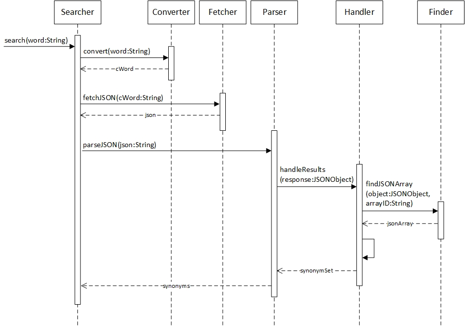

## **Aihe:** Britionary

Toteutetaan sovellus, joka muuntaa amerikanenglannin sanat niiden brittivastineiksi.

Ohjelma hakee Oxford Dictionary:n tesauruksesta halutun sanan Englannin, Irlannin ja Skotlannin alueelliset synonyymit, sekä tulostaa näiden lausumismuodon. Lisäksi ohjelma hakee tietosanakirjasta synonyymia vastaavan äänitiedoston.

Ohjelma toteutetaan logiikalla, joka suodattaa Oxford Dictionaryn palauttamia arvoja.

### **Käyttäjät**
Kaikki, jotka haluavat kehittää brittiläistä aksenttiaan.

### **Toiminnot**
* Sanojen hakeminen
* Synonyymien listaus
* Äänitiedoston soittaminen

### **Luokkakaavio**

### **Sekvenssikaavio**
_Synonyymien onnistunut hakeminen_

_Sanasta ei pystytä hakemaan JSON:ia Oxford Dictionary:n rajapinnasta_

