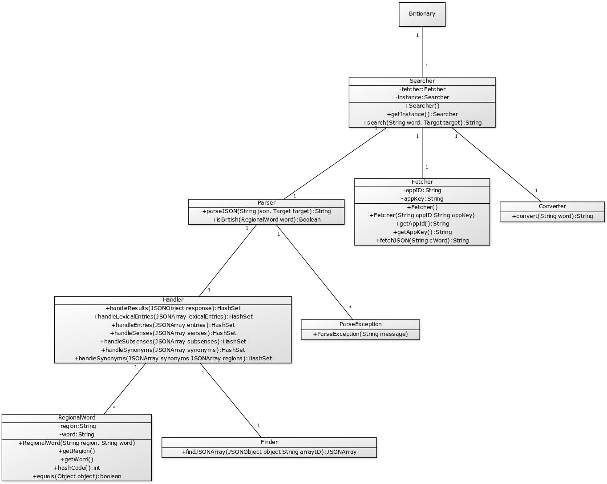
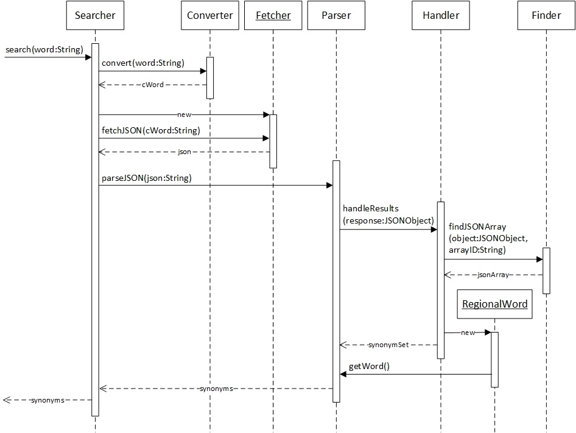
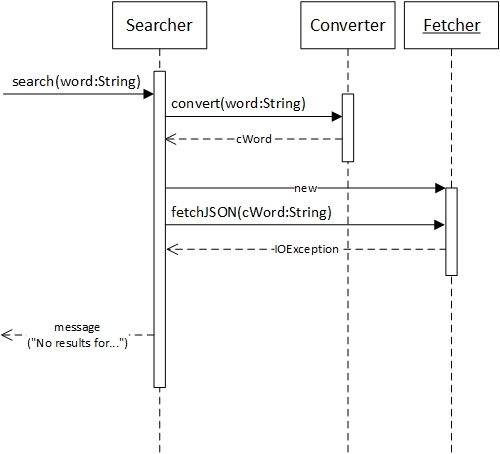

## **Aihe:** Britionary

Toteutetaan sovellus, joka muuntaa amerikanenglannin sanat niiden brittivastineiksi.

Ohjelma hakee Oxford Dictionary:n tesauruksesta halutun sanan Englannin, Irlannin ja Skotlannin alueelliset synonyymit, sekä tulostaa näiden lausumismuodon. Lisäksi ohjelma hakee tietosanakirjasta synonyymia vastaavan äänitiedoston.

Ohjelma toteutetaan logiikalla, joka suodattaa Oxford Dictionaryn palauttamia arvoja.

### **Käyttäjät**
Kaikki, jotka haluavat kehittää brittiläistä aksenttiaan.

### **Toiminnot**
* Sanojen hakeminen
* Synonyymien listaus
* Äänitiedoston soittaminen (TODO)

### **Käyttöohjeet**
Sanoja voi hakea kirjoittamalla ne hakupalkkiin ja painamalla enter-näppäintä tai vastaavasti klikkaamalla jompaa kumpaa käyttöliittymän hakunäppäintä. Enter-pikanäppäin toimii ainoastaa brittisynonyymien hakemiseen. Kaikkia synonyymeja voi kokeilla hakea tab + enter -yhdistelmällä.

Brittisynonyymihakua voi kokeilla esimerkiksi seuraavilla hakusanoilla: __*little*__, __*huge*__, __*mad*__ ja __*genius*__.
### **Rakennekuvaus**
Ohjelman sovelluslogiikka on jaettu kolmen pääluokan välille: Fetcher noutaa JSON-merkkijonoja, Parser nimensä mukaisesti parsii ne ja Converter muuntaa hakusanat ohjelman toiminnan kannalta oikeaan hakumuotoon. Searcher hakee sanoja kutsumalla näiden luokkien julkisia metodeita.

Parser käyttää lisäksi Handleria, joka käy läpi JSON-objektin sisällä olevat JSON-objektit ja palauttaa niiden sisältämiä sanoja. Handler puolestaan käyttää apuna Finderia JSON-taulukoiden löytämiseen. ParseExceptionia käytetään parsimispoikkeuksien luomiseen.

### **Luokkakaavio**

### **Sekvenssikaaviot**
_Synonyymien onnistunut hakeminen:_

_Sanasta ei pystytä hakemaan JSON:ia Oxford Dictionary:n rajapinnasta:_

